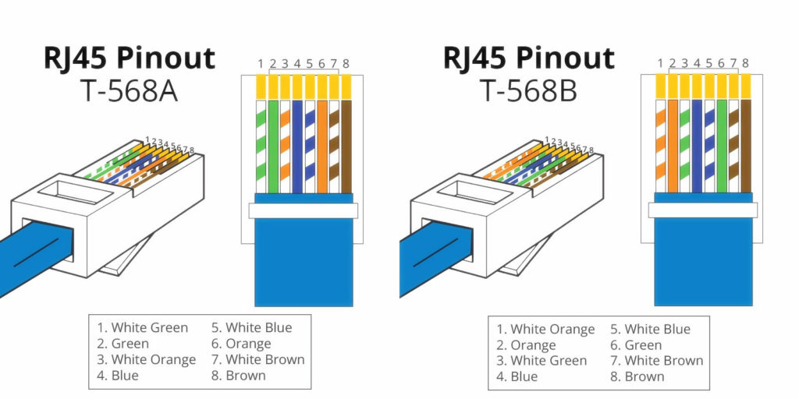
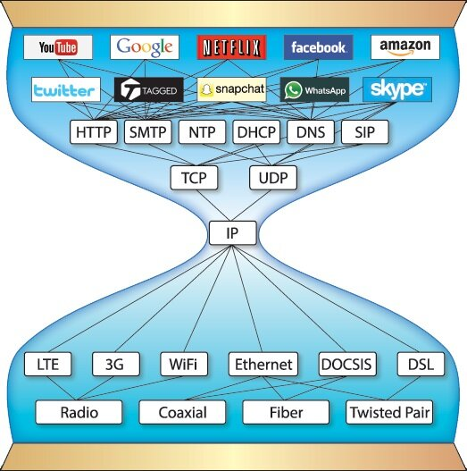

## network 정의?
정보의 공유 = 데이타의 공유
## bit and byte

## 장비 구성 방법
<pre>
-TUI : 툴기반
-GUI : 경로 (그래픽) 
-CLI : 설정 (커맨드) -필수 설정  : 설정을 하지 않으면 통신이 안되는 설정
                -옵션  설정 : 설정을 하지 않아도 통신이 되는 설정  => 해주면 좋아~ 
</pre>
> ## lan local area network
<pre>
  사용자가 포함된 네트워크
  비용: 초기 많다
  관리: 내부관리자
  속도: 100base Tx - 100mega digital transmission (tx = twist pair, crossover cable)
  4tp: 8 line, (4 twist pair) - Tx선 구조는 (카메라)
</pre>
[4tp wire structure T-568b](http://floraoflangkawi.org/wp-content/uploads/2018/06/cat6-network-cable-wiring-diagram-elegant-t568a-t568b-rj45-cat5e-cat6-ethernet-cable-wiring-diagram-home-of-cat6-network-cable-wiring-diagram-in-cat6-wire-diagram.jpg)

> tp type \
UTP
STP 전자간섭의 유무에 따라 쉴드가 있고 없고

<pre>
  UTP종류
  관리목적 -- rollover rolled 콘솔케이블 
  통신목적 --
  다른장비: 다이렉트 (스위치 허브/ 피시 라우터는 같은 장비로 취급) 568b 568b
</pre>

  

<u>같은 장비:</u> 크로스오버 568b 568a

switch/hub = Lan 구간

<pre>
  
  IPX UDP(lan) 통신망의 종류
  Ipx
  UDP (비...)
  http://www.inven.co.kr/webzine/news/?news=165870
  https://www.ionos.com/digitalguide/server/know-how/udp-user-datagram-protocol/

</pre>

> ## wan wide area network
랜과 랜을 연결하는 광역네트워크, ISP internet service provider를 이용
비용: 지속적으로 든다
관리: ISP
참고: t1(1554k) e1(2048k) 1m = 1000k
장비: 라우터

full-mesh N(n-1)/2  5:10회로가 필요  10:45개 회선이 필요 - 안정적
star-mesh (hub & spook) n-1

pstn isdn adsl vdsl 광선 기가랜선
          bisdn
-----
네트웤그 구축의 핵심
확장성
> 이중성
  백업 \ 로드분산

****
데이타 전송관계

서버: 정보를 생성 (listen 상태)
클라이언트: 사용자에게 서비스 함

참고: wireshark.org에서 설치하고 연습하기

데이타전송 유형 IPv4
unicast: 1대1 클라이언트 하나에 (일반적인 인터넷)
broadcast: 1대 불특정 다수 (방송국) 개선을 위해서 VLAN을 사용
multicast: 1대 특정 다수 (인터넷 방송)

참고: broacast pluggin의 차이점: 플러그인은 수신포토에서 들어오는 데이타를 

## private and public network

