<!-- vscode-markdown-toc -->
* 1. [Tasks](#Tasks)
* 2. [EVE 설치방법 step1 2](#EVEstep12)
* 3. [step3](#step3)
* 4. [step 4](#step4)
	* 4.1. [가상머쉰 스타트!!!!](#)
* 5. [step 5](#step5)
* 6. [step 6](#step6)
* 7. [step 7](#step7)
* 8. [step 8](#step8)
* 9. [step 9](#step9)

<!-- vscode-markdown-toc-config
	numbering=true
	autoSave=true
	/vscode-markdown-toc-config -->
<!-- /vscode-markdown-toc -->

from diary
- MEMO: ram nvram을 구분하여 공부하자. 설정하면 자동저장되는것이 램. 휘발성 메모리
- nvram 명령어를 입력해야만 저장되고 명령어로 삭제 됨. 비휘발성 메모리임.

- NOTE: [cisco util](cisco_util.md)

[crt 5.0](https://cezacx2.tistory.com/522)
[dyna gen](https://dynagen.com/sites/default/files/Support%20Files/MAN-0095R1.1,%20DYNAGEN%20Configurator%20Manual.pdf)
[packet tracer 7](https://www.itechtics.com/packet-tracer-download/)

# Saturday, July 6, 2019
- MEMO:  todo winPcap.org에서 다운로드한후 실행해서 설치함, 이후 다시 다이나밉 실행함
- MEMO: GNS EVE, EVE가 고급 이상적임

##  1. Tasks
- [ ] TASK: start R1 R2 R3
- [ ] TASK: dynammips 폴더에서 tmp 내용 삭제하고,  다이나밉스서버 실행하고 최소화한수 ccna를 클랙함
- [ ] TASK: secure crt, putty hyperterminal -- CRT로 랩을 진행
- [ ] TASK: dynamips dynagen.org - 애뮬. VM과 비슷 1인 3라우터 형태로 랩을 구성함
- [ ] TASK: routing event design and equipment

##  2. EVE 설치방법 step1 2

>http://blog.naver.com/PostView.nhn?blogId=jga0674&logNo=221030110935
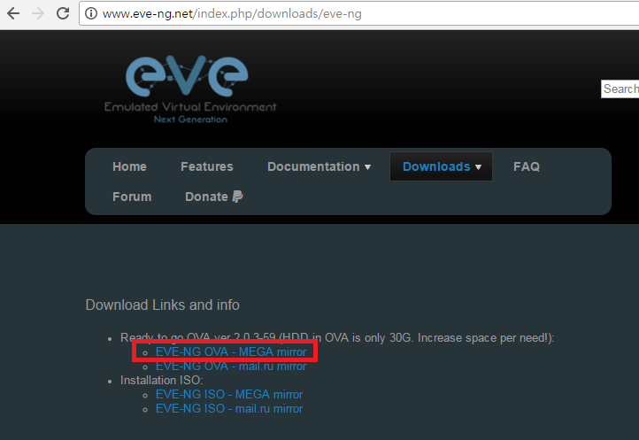
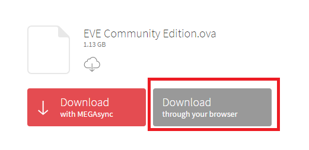
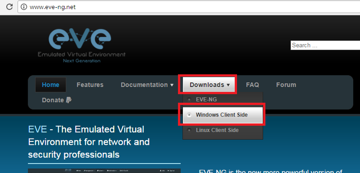
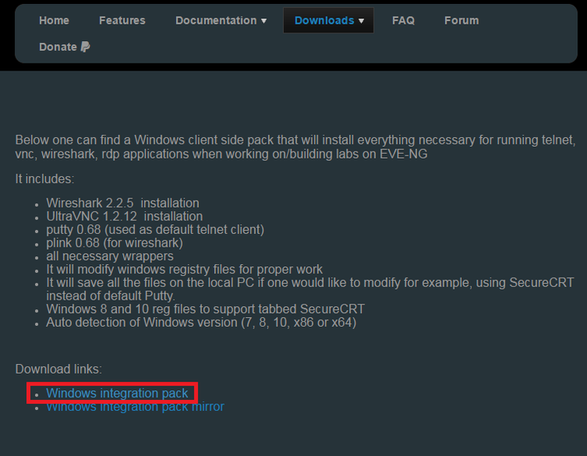
 `all the necessary files have so far been downloaded`

##  3. step3

>Step3 VMware에 OVA 파일을 가상 피씨로 등록 - VMware 12 pro
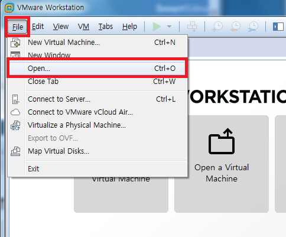
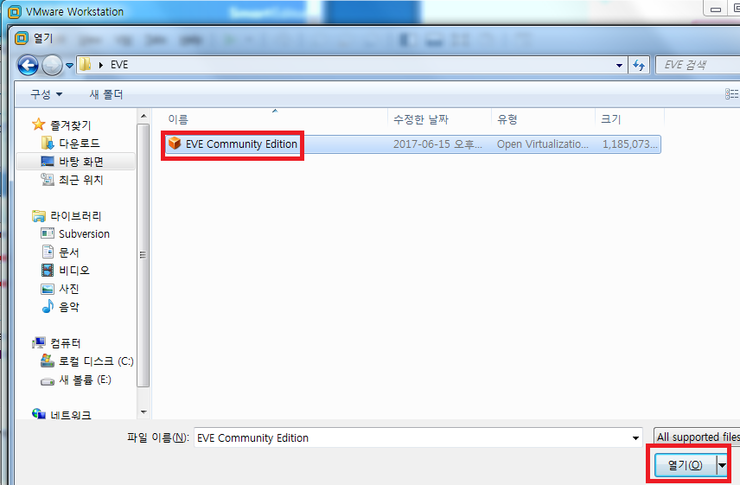
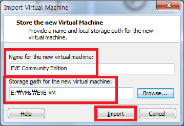

##  4. step 4

`<Step4 설정하기>`
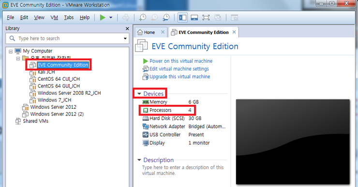
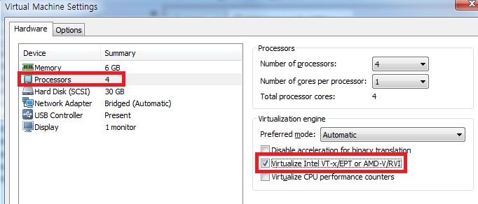
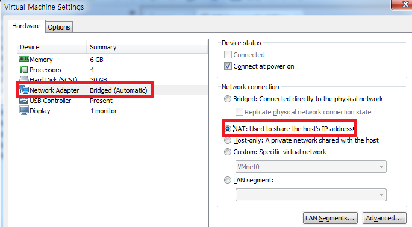

###  4.1. 가상머쉰 스타트!!!!

+     steps
      - default user/pw = root/eve
      - root pw setting box
      - hostname setting
      - domain name setting
      - dhcp/static ip setting
>go to Edit>virtual network editor
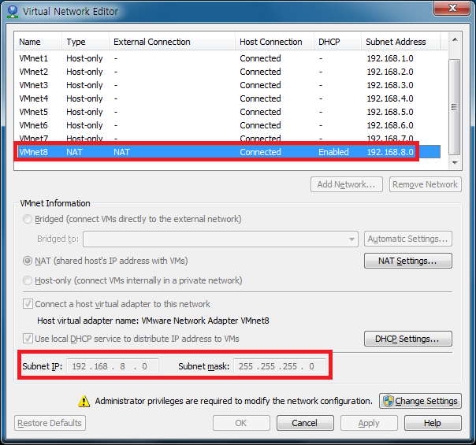

>Gateway DNS 설정
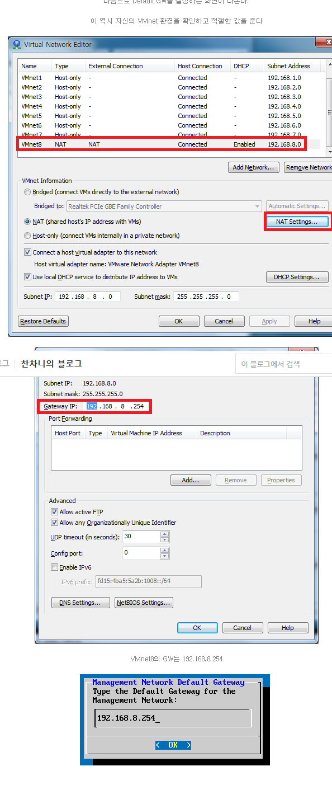
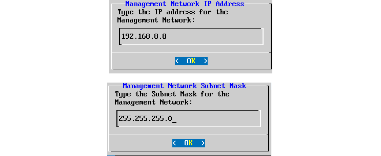
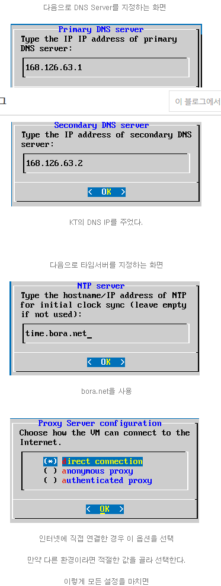

> 가상 머쉰이 재부팅된다.
-----

##  5. step 5

>Step5 WinSCP installation and setup
`[link]`: https://winscp.net/eng/download.php
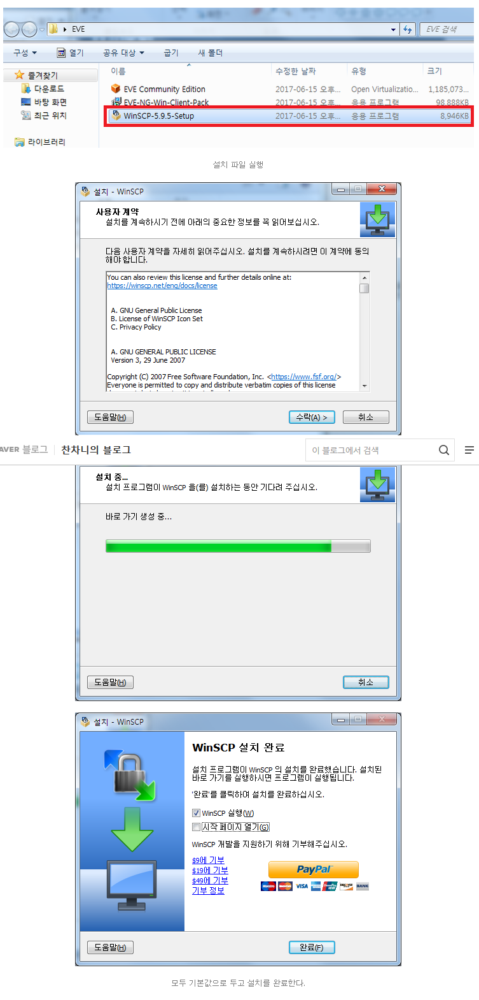

##  6. step 6

>Step6 file transfer and settings
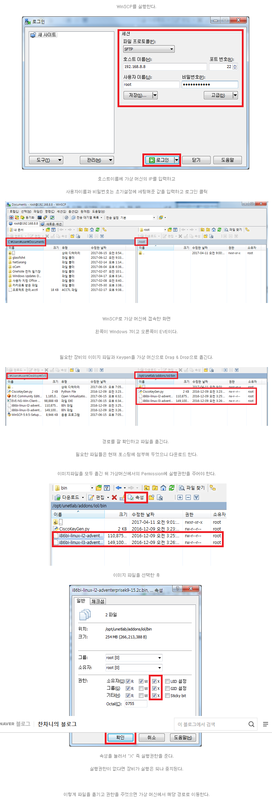
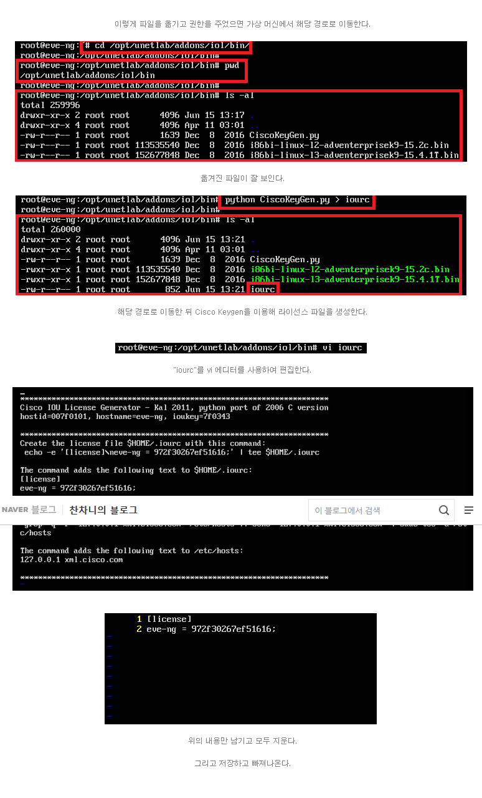

##  7. step 7

>Step7 Client and terminal install and config
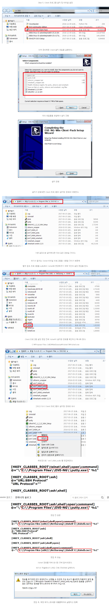

##  8. step 8

>step8 Webbrowser login and adding additional equipment
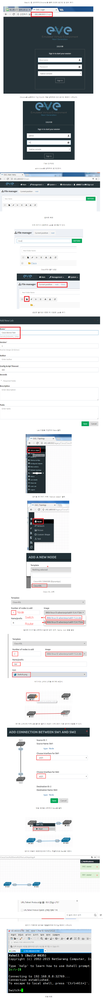

##  9. step 9

>step9 expanding vm hd capacity and wireshark
