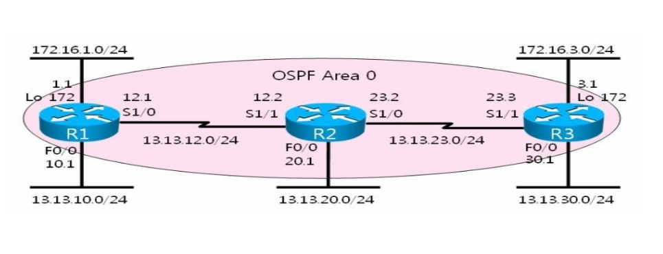

## 5부 라우팅 개요

Router 가 사용하는 스위칭 방식
=> routing table 참조 여부

-Process switching : DATA 를 전송할때마다 매번 routing table 을 참조하는 방식 

-Fast switching :처음에만 routing table 을 참조하면서 자신의 캐시table 에 복제하고 이후에는 캐시 table 을 참조해서 DATA  전송 --< 목적지 ip 주소에 따라서>

-CEF : routing table 이 완성이 될때 자신의 CEF table 에 복제를 하고 CEF table 을 참조해서 DATA 를 전송 
         즉 rouing table 을 한번도 참조하지 않는다
         Cisco express forwarding <출발지 목적ip 주소에 따라서 경로가 달라진다.  ip loading share per packet>

routing table 을 매번 참조하든 아니든 routing table 에 있어야만 복제를 할수가 있다 
즉 routing table 에 정보가 있어야 통신이 가능하다 없으면 통신이 불가능

do sh ip domain

[참고]
로드 분산을 하는 경우의 차이

-Process switching : 매번 차례대로 진행을한다
-Fast switching :목적지 ip 주소에 따라서 경로가 달라진다
-CEF : 출발지 ip , 목적지 ip 주소에 따라서 경로가 달라진다 

+ CEF : ip load-sharing per-packet 을 로드 분산할 interface 설정을 하면 패킷별로 로드 분산이 된다  

### Dynamic
AS (autonomous system)

==> 지역단위 (대학, 통신사 지사)

-Dynamic 

  IGP : 내 네트워크를 관리자가 설정해주면 알아서 동적으로 전파 (자기 소개하기)
  -distance vector : Ripv1,Ripv2
  -link - state : OSPF , IS-IS
  -advance distance vector : EIGRP

  EGP : 본인의 routing table 에 있는 정보를 관리자가 설정하면 알아서 동적으로 전파 (우리반 소개하기)
  -path vector : BGPv4 

[참고]
routing protocol 의 T/S 기본 방법

전체 네트워크가 7개면  routing table 이 기본 7개가 나와야 한다 
근데 7개가 나오지 않으면 문제가 있다라고 인식한다 그리고
routing table 에 없는 네트워크 정보를 찾는다

-static 일 경우
 그 라우터에서 제대로 그 네트워크를 설정해줬는지  sh run 으로 확인

-dynamic 일 경우
 routing table 에 없는 네트워크를 가진 router 를 찾은 후에 그 router 에서 제대로 설정 해줬는지 sh run 으로 확인

  ## 6부 RIP

  3:14 PM
  
### distance vector의 특징
 distance vector

주기적으로 인접한 router 에게만 routing table 전체를  update 한다

update 를 위한 대역폭 소비량이 많다
update 를 위한 CPU 소모율이 많다 
=> 장비 소모량이 많다

구조가 간단하다
확장성이 떨어진다
변화에 적응이 느리다
알고리즘상 루프가 발생을 한다
(루프 방지법:Split-Horizon : 수신한 정보를 수신한 interface 로 다시 전송하지 않는다)  eigf

###
Ripv1

1.개방형 
2.AD  120
3.UDP = 520
4.classful routing protocol
5.VLSM,CIDR 지원 X
6.자동 요약만 지원 
7.broadcast update (255.255.255.255)

8.update 주기 시간                      : 30 초
   invaild time(수신 대기 시간)       : 180초 
   holddown time(삭제 대기 시간)  : 180초
   flushed time (총 삭제 시간)        : 240초

- 9.<u>균등 로드 분산만 지원</u> (기본 4개 ~ 최대 16개) 범위 : 1 ~ 16 까지 조절이 가능 

10.metric = hop  count = Router 경유 수(범위:1 ~ 15) 16이면 limit 라고 해서 장애 발생으로 인식

11. ripv1 필수 설정

ripv1 은  classful 로 동작 , 설정은 classful 하게 설정

** [주의]동작과 설정은 별개

172.16.1.0 /24
13.13.10.0 /24
13.13.12.0 /24

router rip 
v 1
net 172.16.0.0
net 13.0.0.0

router ?
router rip
network (net)
서브넷 무시
1cass
router rip
net 172.16.0.0
net 13.0.0.0

###
Ripv2 필수 설정

동작은 classless , 설정은 classful 하게 설정

172.16.1.0 /24
13.13.10.0 /24
13.13.12.0 /24

router rip
v 2
net 172.16.0.0
net 13.0.0.0
no au

### Ripv2  옵션 설정

1> triggered  update 설정 (WAN 구간 P2P 구간만 지원)

triggered  update 를 할 구간에 연결된 모든 interface 에서 설정

R1
int s 1/0
ip rip triggered

R2
int s 1/1
ip rip tr

triggered  update 를 설정을 하면 주기적인 update 를 하지 않는다
변화가 생겼을때만 update 를 해준다 (multi cast)

2>해시함수를 이용한 MD5 인증 설정 (수학적 계산법, 무결점 증명)

1.인증할 구간에 연결된 모든 router 에서 key chain 을 설정한다

key chain AAA                서로 달라도 상관이 없다
key 13                            서로 동일해야 한다  
key-string cisco               서로 동일해야 한다

2.인증할 구간에 연결된 모든 interface 에서 key-chain 을 적용한다

R1
int s 1/0
ip rip authentication key-chain AAA
ip rip authentication mode md5

R2
int s 1/1
ip rip au k AAA
ip rip au m m

3>수동 요약 설정

요약 설정이 필요한 이유 : routing table 의 크기를 줄여주기 위해서
=> update 를 위한 CPU 소모율 줄어들고 , update 를 위한 대역폭이 줄어든다
=> 장비 소모량이 줄어든다

요약이 되면 NULL 경로가 필요한다 즉 NULL 경로가 생성이 되어야 한다
기본적으로 자동 생성이 되는데 RIPV2 는 자동 생성이 되지 않는다 => 수동 생성을 해야 한다

NULL 경로가 생성되어야 하는 이유는 루프를 방지 

Ripv2 는 수동 생성

ip route [요약 내용][netmask] null 0

요약 설정

요약을 넘겨줄 interface 에 설정

int s 1/0
ip summary-address rip [요약내용] [netmask]

보안

기밀성
data  유출방지

암호화: 복호화가 가능
암호화 알고리즘. 키값
[1234] => [!@#$] ==> [1234]

무결성
data 변조를 방지

인증: 복호화가 블가능
인증 알고리즘
키값
!@#$ --해쉬 값
 [!@#$][1234]

 router rip
 v 2
 net 172.16.0.0
 net 13.0.0.0
 no auto summary (no au)

## Day5    12:21 PM
router - id (eigrp, ospf, bgv4) 
Router 를 구분하는 식별자 (IPv4 주소 형식으로만 진행*IPv6 에서도 동일하다)

Router - id 선출 기준

1.설정

router eigrp 100
eigrp router-id 1.1.1.1

2.loopback interface 의 ip 중에서 숫자가 가장 큰 ip 가 router-id 로 선출

3.물리적인 interface 의 ip 중에서 숫자가 가장 큰 ip 가 router-id 로 선출

(p236 ex-24-14)

### eigrp torpology table analysis

(동영상 참고) 12:46 PM

[참고] 12:50 PM
비균등 로드 분산을 하려면 2가지의 조건이 만족 되어야 한다

1>variance 값을 이용해서 최적 경로의 metric 보다 비균등 로드 분산 하려는 경로의 metric 을 작게 만들어 준다

2>최적 경로의 FD 보다 작은 AD 값을 가지고 있어야 한다(후속 경로)

1:03 PM
ex 24-21

25장 eigrp 정보확인

디버깅 분석

디버깅을 끄는 방법
do un all

3:44 PM
8부 ospf

OSPF (Open Shortest Path First)

Link - State 에 속해있는 SPF 알고리즘을 사용하는 대표적인 개방형 Routing Protocol 이다

    Link  - State

1.Link 변화시 인접성을 맺은 모든 router 에게 변화된 내용만 update 를 한다
>참고
2> 네트워크 정보의 출처까지 포함해서 update 한다
 =>즉 각각의 Router 에서 전체적인network 를  판단할수가 있다( database table 에 있다)
=> 변화가 많으면 오히려 장비 소모량이 많아진다
     (해결 방안 : 하나의 AS 안에 여러 area 로 구분을 하는 2계층 구조를 가진다)
-구조가 복잡 (인접성)

  =>인접성을 맺어야만 정보를 update 한다
      즉 인접성을 맺지 않으면 정보가 교환되지 않는다 
      그래서 인접성을 맺는 것들은  제일 먼저 인접성을 맺었는지 확인
[참고]

distance vector  : slow
link - state : fast
eigrp : very fast

2.classless routing protocol

-VLSM,CIDR 지원 된다  => 수동요약만 지원한다 

3.multicast update

OSPF     224.0.0.5~6 

[참고]

OSPF     224.0.0.5~6 
Ripv2     224.0.0.9
EIGRP    224.0.0.10

## OSPF (Open Shortest Path First)

Link - State 에 속해있는 SPF 알고리즘을 사용하는 대표적인 개방형 Routing Protocol 이다

1.AD 110
2.Version  2   참고 : IPv6 OSPF (Version 3)
3.개방형 
4.classless routing protocol
5.VLAM,CIDR 지원 O
6.수동 요약만 지원 (no au 하면 안됨)
7.multicast update 224.0.0.5~6 (Hello : 224.0.0.5)

[참고]
수동적으로 neighbor 이라는 명령어로 인접성을 맺게 되면 unicast 로  update 가 된다

9.metric = COST = 10^8/BW  =  100M/BW
[참고]
10^7 = 10M , 10^8 = 100M , 10^9 = 1000M

   10M  = 10^8/10^7 = 100M/10M   = 10
  100M  = 10^8/10^8 = 100M/100M   = 1   경로 선출

  100M  = 10^8/10^8 = 100M/100M    = 1
 1000M  = 10^8/10^9 = 100M/1000M   = 1   불필요한 균등 로드 분산 

불필요한 균등 로드 분산을 해결하려면 

auto-cost reference-bandwidth 명령어를 사용

router ospf 1
auto-cost reference-bandwidth  1000

설정을 하면 100M/BW 를 1000M/BW 로 변경

  100M  = 10^9/10^8 = 1000M/100M    = 10
 1000M  = 10^9/10^9 = 1000M/1000M   =  1    경로 선출

 10. 2계층 구조 
(계층적 구조 : 하나의 AS 안에 여러 area  로  구분)

- area 0 은 backbone area 이고 서로 다른 area 가 통신 하려면 area 0 을 통해서 통신할수 있다 즉 일반 area 들은 area 0 에 연결이 되어있어야 한다

=>물리적으로 연결이 되어있지 않으면 Virtual-link 설정을 해줘야 한다
   (방향쪽 ABR 과 물리적으로 연결되어있지 않은 area 의 경계 Router 에서 설정)

   11.인접성

Hello   : 인접성을 맺고 유지(인접성의 조건) 유지시간 4배차이 
DBD    : 전체적인 정보를 교환 database discussion
LSR     : 새로운 정보를  요청 
LSU     : LSR 에 대한 응답
LSA     : 승인  

### Hello 

Router-id  : Router 구분하는 식별자 
=> 서로  동일하면 인접성을  맺을수 없다

DR,BDR  주소  desginated , backup designated router
Priority (우선 순위값) = 기본값 1 (범위 : 0 ~ 255)
[주의점] Priority값이 0이면 절대로 DR ,BDR 되지 않는다
subnetmask -classless
neighbor's list

area-id (area 번호) => 서로 동일해야 한다
authentication password(인증 암호) => 서로 동일해야 한다
-무인증(0) 평문 인증(1) MD5인증(2)
Hello,Dead(Hello 수신대기 시간) <u>interval(주기)4배차이 => 서로 동일 해야 한다</u>
stub area flag : stub 으로 지정된 area 안에 있는 모든 router 는 stub 이라고 설정 
=> 서로 동일해야 한다

MTU : 전송 최대 크기 유닛 => 서로 동일해야 한다

DR,BDR 의 선출 기준

1.Priority = 1 ( 0~255 ) 0 이면 절대로 DR,BDR 되지 않는다
=>Priority 값이 가장 큰 Router 가 DR 이 되고 그 다음이 BDR 이 되고 나머지는 DRother 가 된다

2.Router-id 
=>Router-id  값이 가장 큰 Router 가 DR 이 되고 그 다음이 BDR 이 되고 나머지는 DRother 가 된다

+ 선출이 된 이후에는 더 좋은 조건의 내용이 와도 변경되지 않는다
   단 재인접성을  (reload  or clear ip ospf process ) 맺으면 선출 기준에 따라서 다시 선출이 된다

13.Network Type --외울것

                                Hello        Dead      DR,BDR 선출 유무     네이버(인접성)
point-to-point                 10           40                 X                     자동
broadcast                       10           40                  O                     자동
point-to-multipoint           30          120                X                    자동   
nonbroadcast                   30          120                O                     수동

14.LSA 광고 타입  -->외울것

          구분      영어 구분      정보                    출처       routing table   database  table 

1     같은 area    intra area    Router-id            Router             O               Router    
2     같은 area    intra area    DR 정보                 DR                                 Net

3     다른 area    inter area    Network정보           ABR             OIA         Summary Net
4     다른 area    inter area    ASBR 정보              ABR                            Summary Asb

5     다른 AS    AS-external   외부네트워크 정보   ASBR             OE1 : metric 증가

Day6 12:13 PM
15. 설정

router ospf 1
area X virtual-link [상대방 router-id]

OSPF 필수 설정

172.16.1.0  /24
13.13.10.0  /24
13.13.12.0  /24

router ospf 1
net 172.16.1.0 0.0.0.255 area 0
net 13.13.10.1 0.0.0.0 a 0
net 13.13.12.1 0.0.0.255 a 0

OSPF 에서 일반 area는 area 0 즉 backbone area 에 연결이 되어 있어야 한다 근데 연결이 되어 있지 않으면 물리적으로 연결되어 있지 않은 방향쪽 ABR 과 물리적을 연결이 되어 있지 않은 AREA 의 경계 Router 에서Virtual-Link 를 설정 해줘야 한다

>virtual link 방법
router ospf 1
area X virtual-link [상대방 router-id]

R2

router ospf 1
area 13 virtual-link 3.3.3.3

R3

router ospf 1
area 13 v 2.2.2.2

### OSPF 옵션 설정

MD5 인증 설정

-interface 인증 설정 : 설정한 구간에서만 인증이 진행된다 
 인증할 구간에 연결된 모든 interface 에서 설정
 |    |    |
|:---|:---|
| R1   | int s 1/0
ip ospf authentication message-digest
ip ospf message-digest-key 13 md5 cisco   |
|  R2  | int s 1/1
ip ospf au m
ip ospf me 13 m cisco
   |

-area 인증 설정
 인증 설정을 한 area 전체가 인증
 인증할 area안에 속해있는 모든 router 에서 설정하고 인접성을 맺은 모든 interface 에 적용

 |    |    |
|:---|:---|
| R1   | router ospf 1
area 0 authentication message-digestint s 1/0
ip ospf authentication message-digest
ip ospf message-digest-key 13 md5 cisco 
int s 1/0
ip ospf message-digest-key 13 md5 cisco
  |
|  R2  | router ospf 1
area 0 au m
int s 1/1
ip ospf me 13 m cisco
   |
R3
router ospf 1
area 0 au m

정보 확인

interface 설정

sh ip route
sh ip int bri
sh run

sh cdp nei  det
sh int s 1/0
sh ip int s 1/0

dynamic 

sh ip protocol

eigrp 

sh ip eigrp to
sh ip eigrp nei
sh ip eigrp traffic

ospf

sh ip ospf nei    : 네이버 관한 정보
sh ip ospf data  : 네이버에게 받은 정보
sh ip ospf int s 1/0 : OSPF가 동작하는  interface 의 정보
sh ip ospf vir  : virtual-link 의 동작 정보 

virtual-link 설정을 하기 전에 sh ip protocol,sh ip ospf nei,sh ip ospf data,sh ip route 정보를  메모장에 복사해놓고 virtual-link 설정을 다 한후에 
sh ip protocol,sh ip ospf nei,sh ip ospf data,sh ip route 정보를 확인해서 비교해라

외부 정보를 재분배하고 sh ip ospf data , sh ip pro , sh ip route 확인 

1:33 PM  day6 2교시
이후 끝까지 책과 네이어 까페 참고 할것
https://cafe.naver.com/itguild/147  --> 실습과제

4:50 PM day6

경로 선출

1>롱기스트 매치룰 : 목적지 ip 에 가장 길게 일치하는 경로가 선출
2>상황에 따라서 

-다수의 routing protocol 이 있을때(다수의 AD 값이 있을때) AD(신뢰도)값이 가장 작은 경로가 선출
 =>dynamic routing protocol 이 여러개일 경우는 거의 없다
 =>dynamic routing protocol 을 주로 쓰고 static 을 백업으로 쓰는 경우가 있다 
 =>routing protocol 의 AD 값은 변경할수 있다 

-동일한 routing protocol 이 있을때(동일한 AD 값이 있을때)metric(경로값)값이 가장 작은 경로가 선출
 =>dynamic routing protocol 은 metric 변경할 수 있다

  routing table 을 완성

1>interface 설정
    interface 설정을 했을때 routing table 에 등록이 되려면 2가지 조건이 있다
    - ip 대역대가 있어야 한다
    - L2 까지 up이 되어있어야 한다

interface 설정을 완성해서 routing table 에 등록

=> router 에 직접 연결된 network (directly conneted) 만 등록이 된다
     즉 routing table 이 전체적으로 완성이 되질 않는다 

routing table 을 전체적으로 완성 시켜주기 위해서  routing protocol 을 구동 시켜준다

## routing-protocol
 Routing protocol 의 종류 

## static  
-Static : 내가 모르는 네트워크 네임을 관리자가 일일이 설정 (남의 이름 물어보기)

ex>ip route 192.168.1.0 255.255.255.224  13.13.12.2

-Dynamic

  -IGP : AS 안에서 빨리빨리가 목적 : 내 네트워크를 관리자가 설정해주면 알아서 동적으로 전파 (자기 소개하기) interior gateway protocol
  rip igrp ospf is-is
  
    -distance vector  : Ripv1 , Ripv2